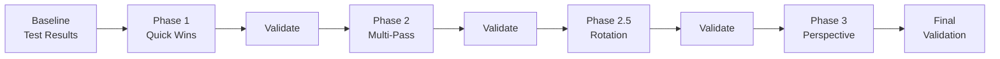

# Improve OMR Corner-Finding Algorithm

Improve the reliability and accuracy of the fiducial corner detection pipeline. Currently, 6 known scans fail detection (E33: `_028`, `_023`, `_024`, `_033`; E34: `_008`, `_013`). Rotated scans (90°/180°/270°) are not handled. The grid uses an affine basis that cannot correct perspective distortion.

## Scope (Confirmed)

- ✅ Phase 3 (Perspective Transform): Will implement — not deferred
- ✅ Pre-rotation detection: Will add as Phase 2.5
- ✅ No backward compatibility with Python version needed
- ✅ 6 specific failing scans identified for regression testing

---

## Proposed Changes

### Phase 1 — Quick Wins (High Impact, Low Effort)

These are small changes to [imageUtils.js](file:///home/daniel/Documents/GitHub/unor-mcr/js/omr/imageUtils.js) that should immediately improve detection rates.

---

#### [MODIFY] [imageUtils.js](file:///home/daniel/Documents/GitHub/unor-mcr/js/omr/imageUtils.js)

**1a. Reduce `approxPolyDP` epsilon: 5% → 2%**

The 5% epsilon aggressively simplifies contours, often collapsing 6-vertex L-marks into 5-vertex pentagons (instant rejection). At 2%, vertex count is preserved while still smoothing noise.

```diff
- cv.approxPolyDP(contour, approx, 0.05 * perimeter, true);
+ cv.approxPolyDP(contour, approx, 0.02 * perimeter, true);
```

**1b. Add morphological closing before edge detection**

Bridges small gaps in printed fiducial lines that would otherwise fragment the L-mark contour:

```js
export function closeGaps(cv, src) {
    const kernel = cv.getStructuringElement(cv.MORPH_RECT, new cv.Size(3, 3));
    const dst = new cv.Mat();
    cv.morphologyEx(src, dst, cv.MORPH_CLOSE, kernel);
    kernel.delete();
    return dst;
}
```

Update `findPolygons` pipeline: `grayscale → blur → **close** → Canny → contours`

**1c. Increase Gaussian blur sigma (2×)**

Current sigma (~1.4px for 2500px) provides negligible smoothing:

```diff
- const sigma = minDim * 5.6569e-4;
+ const sigma = minDim * 1.1314e-3;
```

**1d. Adaptive Canny thresholds via Otsu**

Replace fixed thresholds (100/300) with image-adaptive values:

```js
export function detectEdges(cv, src) {
    const tempDst = new cv.Mat();
    const otsuThresh = cv.threshold(src, tempDst, 0, 255, cv.THRESH_BINARY | cv.THRESH_OTSU);
    tempDst.delete();
    
    const low = Math.max(30, otsuThresh * 0.5);
    const high = Math.min(400, otsuThresh * 1.5);
    
    const dst = new cv.Mat();
    cv.Canny(src, dst, low, high, 3, true);
    return dst;
}
```

---

### Phase 2 — Robustness: Multi-Pass & Candidate Ranking

Make the algorithm resilient to imperfect scans instead of failing outright.

---

#### [MODIFY] [cornerFinder.js](file:///home/daniel/Documents/GitHub/unor-mcr/js/omr/cornerFinder.js)

**2a. Parameterize `findPolygons` epsilon and pass through**

Modify `findPolygons` to accept an `epsilon` parameter so `cornerFinder` can retry with different values.

**2b. Multi-pass retry with progressive tolerance relaxation**

```js
export function findCornerMarks(cv, imageMat) {
    const epsilons = [0.02, 0.03, 0.05];
    const toleranceMultipliers = [1.0, 1.5, 2.0];
    
    for (const eps of epsilons) {
        for (const mult of toleranceMultipliers) {
            try {
                return findCornerMarksCore(cv, imageMat, eps, mult);
            } catch { continue; }
        }
    }
    throw new Error("Could not detect alignment fiducial corner marks after multiple attempts.");
}
```

Extract current `findCornerMarks` body into `findCornerMarksCore(cv, imageMat, epsilon, toleranceMult)`.

**2c. Rank L-mark candidates instead of first-match**

Collect all valid L-mark + 3-square combinations across all hexagons, score each by sum of centroid distances from nominal positions, and pick the best:

```js
function scoreLMarkCandidate(topRight, bottomLeft, bottomRight, basisTransformer, nominals) {
    const trDist = centroidDistFromNominal(topRight, basisTransformer, nominals.tr);
    const blDist = centroidDistFromNominal(bottomLeft, basisTransformer, nominals.bl);
    const brDist = centroidDistFromNominal(bottomRight, basisTransformer, nominals.br);
    return trDist + blDist + brDist; // lower = better
}
```

**2d. Partial match fallback (2 of 3 squares)**

If no hexagon yields all 3 squares, fall back to accepting 2-of-3 and estimating the missing corner geometrically from the L-mark and the 2 found squares using vector projection.

---

### Phase 2.5 — Pre-Rotation Detection

Detect and auto-correct 90°/180°/270° rotated scans before corner finding.

---

#### [MODIFY] [imageUtils.js](file:///home/daniel/Documents/GitHub/unor-mcr/js/omr/imageUtils.js)

**2.5a. Add `detectAndCorrectRotation(cv, imageMat)` function**

Strategy: The L-mark is always in the **top-left** corner of a correctly oriented sheet. After finding polygons, check which quadrant contains the most L-mark candidates. If the best candidate is not in the top-left quadrant, rotate the image by the appropriate multiple of 90°.

```js
export function detectAndCorrectRotation(cv, imageMat) {
    // 1. Find all hexagons that pass LMark validation
    // 2. For each valid LMark, check which image quadrant its centroid falls in
    // 3. Determine required rotation:
    //    - TL quadrant → 0° (correct)
    //    - TR quadrant → 270° (rotate CW)
    //    - BR quadrant → 180°
    //    - BL quadrant → 90° (rotate CCW)
    // 4. Apply cv.rotate() with appropriate flag
    // 5. Return { rotatedMat, rotationApplied }
    
    const rotations = [
        null,                    // 0° - try as-is
        cv.ROTATE_90_CLOCKWISE,  // 90° CW
        cv.ROTATE_180,           // 180°
        cv.ROTATE_90_COUNTERCLOCKWISE // 270° CW
    ];
    
    for (const rot of rotations) {
        const testMat = rot !== null ? rotateMat(cv, imageMat, rot) : imageMat;
        // Try to find corner marks - if successful, this is the right orientation
        // Quick check: does the L-mark fall in TL quadrant?
    }
}
```

#### [MODIFY] [cornerFinder.js](file:///home/daniel/Documents/GitHub/unor-mcr/js/omr/cornerFinder.js)

**2.5b. Integrate rotation into `findCornerMarks`**

Wrap the main detection with rotation attempts:

```js
export function findCornerMarks(cv, imageMat) {
    // Try all orientations: 0°, 90°, 180°, 270°
    const rotations = [null, cv.ROTATE_90_CLOCKWISE, cv.ROTATE_180, cv.ROTATE_90_COUNTERCLOCKWISE];
    
    for (const rotation of rotations) {
        let mat = imageMat;
        if (rotation !== null) {
            mat = new cv.Mat();
            cv.rotate(imageMat, mat, rotation);
        }
        
        // Try multi-pass detection on this orientation
        for (const eps of [0.02, 0.03, 0.05]) {
            for (const mult of [1.0, 1.5, 2.0]) {
                try {
                    const result = findCornerMarksCore(cv, mat, eps, mult);
                    if (rotation !== null) mat.delete();
                    return { ...result, rotation };
                } catch { continue; }
            }
        }
        
        if (rotation !== null) mat.delete();
    }
    throw new Error("Could not detect alignment fiducial corner marks.");
}
```

#### [MODIFY] [pipeline.js](file:///home/daniel/Documents/GitHub/unor-mcr/js/omr/pipeline.js)

**2.5c. Handle rotated image in pipeline**

When `findCornerMarks` returns a rotation, apply the same rotation to the image mat before passing to `Grid`:

```js
const found = findCornerMarks(cv, imageMat);
let processedMat = imageMat;
if (found.rotation !== null) {
    processedMat = new cv.Mat();
    cv.rotate(imageMat, processedMat, found.rotation);
}
const grid = new Grid(found.corners, processedMat, cv);
```

---

### Phase 3 — Accuracy: Perspective Transform

Replace the affine basis in `Grid` with a 4-point perspective homography.

---

#### [MODIFY] [gridReader.js](file:///home/daniel/Documents/GitHub/unor-mcr/js/omr/gridReader.js)

**3a. Replace `ChangeOfBasisTransformer` with `cv.getPerspectiveTransform` in Grid**

```js
export class Grid {
    constructor(corners, imageMat, cv) {
        this.cv = cv;
        this.imageMat = imageMat;
        this.corners = corners; // [TL, TR, BR, BL]
        this.horizontalCells = GRID_HORIZONTAL_CELLS;
        this.verticalCells = GRID_VERTICAL_CELLS;

        // Perspective: normalized [0,1] space → image pixel space
        const srcPts = cv.matFromArray(4, 1, cv.CV_32FC2, [
            0, 0,  1, 0,  1, 1,  0, 1  // unit square
        ]);
        const dstPts = cv.matFromArray(4, 1, cv.CV_32FC2, [
            corners[0].x, corners[0].y,  // TL
            corners[1].x, corners[1].y,  // TR
            corners[2].x, corners[2].y,  // BR
            corners[3].x, corners[3].y   // BL
        ]);
        
        this._perspMat = cv.getPerspectiveTransform(srcPts, dstPts);
        srcPts.delete();
        dstPts.delete();
        
        this.horizontalCellSize = 1 / this.horizontalCells;
        this.verticalCellSize = 1 / this.verticalCells;
    }
    
    // Map normalized grid coord → image pixel coord using perspective
    _gridToImage(normX, normY) {
        const d = this._perspMat.data64F;
        const w = d[6] * normX + d[7] * normY + d[8];
        return new Point(
            (d[0] * normX + d[1] * normY + d[2]) / w,
            (d[3] * normX + d[4] * normY + d[5]) / w
        );
    }
}
```

**3b. Update `getCellShape` to use perspective mapping**

```js
getCellShape(across, down) {
    const x0 = across * this.horizontalCellSize;
    const y0 = down * this.verticalCellSize;
    const x1 = (across + 1) * this.horizontalCellSize;
    const y1 = (down + 1) * this.verticalCellSize;
    return [
        this._gridToImage(x0, y0),
        this._gridToImage(x1, y0),
        this._gridToImage(x1, y1),
        this._gridToImage(x0, y1)
    ];
}
```

**3c. Update `getCellRange`, `getCellCircle`, `getFillPercent`** to work with the new `getCellShape`. The API stays identical — only the internal coordinate mapping changes.

**3d. Add cleanup method** to delete the perspective matrix:

```js
dispose() {
    if (this._perspMat) {
        this._perspMat.delete();
        this._perspMat = null;
    }
}
```

#### [MODIFY] [pipeline.js](file:///home/daniel/Documents/GitHub/unor-mcr/js/omr/pipeline.js)

**3e. Call `grid.dispose()` after processing** to free the OpenCV perspective matrix.

#### [MODIFY] [geometry.js](file:///home/daniel/Documents/GitHub/unor-mcr/js/omr/geometry.js)

No changes. `ChangeOfBasisTransformer` is kept for use in `cornerFinder.js` during the L-mark coordinate system search. Only `gridReader.js` gets the perspective upgrade.

---

### Phase 4 — Validation & Regression Testing

---

#### Test Strategy

**Before any code changes**, baseline the 6 failing scans + 4 sample scans + rotation images:

| Test Set | Files | Expected Outcome After Fix |
|----------|-------|---------------------------|
| Sample scans | `assets/sample_scan_*.png` (4 files) | Should continue to pass, identical decoded answers |
| E33 failing | `Scans/E33/PNG/_028, _023, _024, _033` | Should now pass detection |
| E34 failing | `Scans/E34/PNG/_008, _013` | Should now pass detection |
| Rotation | `test/end-to-end/rotation/input/90deg.jpg, 180deg.jpg, 270deg.jpg` | Should detect + auto-correct rotation, successfully read sheet |
| Rejected | `test/end-to-end/rejected-file/reject.png` | Should still fail (not an answer sheet) |
| Low-res | `test/end-to-end/low-resolution/input/example.png` | Should pass or improve |

#### Verification Method

1. **Copy the 6 failing JPGs** into `assets/` so they can be loaded via the batch scanner UI
2. **Serve the app** and batch-process all test images in browser
3. **Compare**: detection success rate, decoded student IDs, decoded answers
4. **Visual inspect**: check fiducial overlay alignment in the Inspector tab for each processed sheet

```bash
cd /home/daniel/Documents/GitHub/unor-mcr
npx -y serve . -p 3000
```

#### Regression Checkpoints

Run validation after each phase:
- **After Phase 1**: Check if any of the 6 failing scans now pass
- **After Phase 2**: All 6 should pass; sample scans unchanged
- **After Phase 2.5**: Rotation images should process successfully
- **After Phase 3**: Verify decoded answers are identical or improved (not regressed) for all passing scans

---

## Execution Order



## Summary of Changes by File

| File | Changes | Phase |
|------|---------|-------|
| [imageUtils.js](file:///home/daniel/Documents/GitHub/unor-mcr/js/omr/imageUtils.js) | Reduce epsilon, morph close, bigger sigma, adaptive Canny, rotation helper | 1, 2.5 |
| [cornerFinder.js](file:///home/daniel/Documents/GitHub/unor-mcr/js/omr/cornerFinder.js) | Multi-pass retry, L-mark ranking, partial fallback, rotation integration | 2, 2.5 |
| [gridReader.js](file:///home/daniel/Documents/GitHub/unor-mcr/js/omr/gridReader.js) | Perspective transform in Grid class | 3 |
| [pipeline.js](file:///home/daniel/Documents/GitHub/unor-mcr/js/omr/pipeline.js) | Handle rotated mat, grid disposal | 2.5, 3 |
| [geometry.js](file:///home/daniel/Documents/GitHub/unor-mcr/js/omr/geometry.js) | No changes | — |
